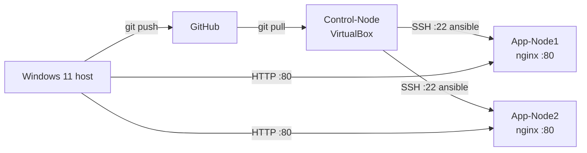

# Project 1 — RHEL Ansible Web Lab

[← Back to portfolio index](../README.md)

## Overview

Built a multi-node RHEL 9 web lab with Ansible, covering baseline hardening, web server deployment, firewall configuration, rolling patching, and read-only troubleshooting. The stack was designed as reusable roles and playbooks, deployed from a control node over SSH, verified with health checks and screenshots, and managed through a Git-based workflow.

## Repository layout

```
project-1-ansible-lab/
├── ansible.cfg                 # Defaults: inventory path, roles, forks
├── collections/
│   └── requirements.yml        # ansible.posix (firewalld module)
├── docs/
│   ├── Ansible Lab Architecture.png  # Deployed to app nodes by webserver role
│   ├── ARCHITECTURE.md
│   ├── Ansible Playbooks.docx
│   ├── Project 1 - What was Implemented.docx
│   └── Milestone Screenshots/  # Evidence for README / interviews
├── inventory/
│   ├── hosts.ini               # App-Node1, App-Node2 targets
│   └── group_vars/
│       └── webservers.yml      # Shared vars (e.g. web_stack: nginx)
├── playbooks/
│   ├── site.yml                # Main entry: common + webserver roles
│   ├── patch.yml               # Rolling dnf updates (serial: 1)
│   └── troubleshoot.yml        # Read-only health / security snapshot
├── roles/
│   ├── common/                 # Packages, chrony, user/sudo, SSH, SELinux, logrotate
│   └── webserver/              # nginx/httpd, firewalld, index template
├── scripts/
│   ├── deploy.sh               # Wrapper for site.yml
│   ├── troubleshoot.sh         # Wrapper for troubleshoot.yml
│   ├── health-check.sh         # Local CPU/mem/disk snapshot
│   └── security-skim.sh        # Local auth failures + SELinux skim
├── LICENSE
└── README.md
```

## Architecture



More detail: [docs/ARCHITECTURE.md](docs/ARCHITECTURE.md).

- **Windows 11 host:** edit/commit/push to GitHub; browser tests **HTTP :80** on each app node.
- **Control-Node** (VirtualBox): pulls the monorepo, runs playbooks from **`project-1-ansible-lab/`**, connects to app nodes over **SSH :22** (`ansible` user + key).
- **App-Node1** and **App-Node2:** `[webservers]` targets running **nginx :80**, with **firewalld** (`http`/`https`) and a templated landing page per host.
- **Playbooks:** `site.yml` (common + webserver), `patch.yml` (rolling updates), `troubleshoot.yml` (read-only health/security).

## What was implemented

### Overview

Built a multi-node RHEL 9 web lab with Ansible, covering baseline hardening, web server deployment, firewall configuration, rolling patching, and read-only troubleshooting. The stack was designed as reusable roles and playbooks, deployed from a control node over SSH, verified with health checks and screenshots, and managed through a Git-based workflow.

### Lab Topology

- Windows 11 host for edit/commit/push
- 3 RHEL VMs on VirtualBox

### Common Role - baseline on each VM

- Common Packages (chrony, curl, vim, rsync, python3, SELinux libs)
- Timezone + chronyd enabled
- ansible lab admin user with sudo and SSH key support
- SSH hardening via drop-in (sshd_config.d), with validate + rollback if config is invalid
- SELinux set to enforcing (targeted policy)
- logrotate drop-in for nginx access/error logs

### Webserver Role

- nginx (default) or httpd
- firewalld enabled with HTTP/HTTPS open
- templated landing page per host
- Architecture diagram deployed to docroot
- SELinux file contexts restored on web content
- Web service enabled and started

### Playbooks

- Site.yml - main deploy: common + webserver
- Patch.yml - rolling dnf updates (serial: 1), optional reboot
- Troubleshoot.yml - read-only health/security snapshot (uptime, disk, memory, CPU, services, listening ports, SELinux mode, auth failures, AVC denials)

### Scripts/wrappers

- deploy.sh - runs site.yml
- troubleshoot.sh - runs troubleshoot.yml
- health-check.sh - local CPU/mem/disk snapshot
- security-skim.sh - local auth failures + SELinux skim

### Repo/workflow

- ansible.posix collection for firewalld
- docs, architecture diagram, and milestone screenshots
- Git-based push/pull workflow between Windows and Control Node (VM)
