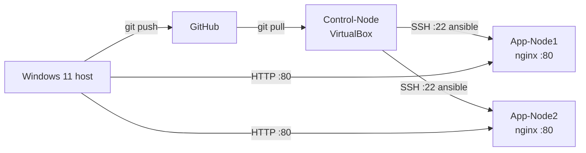

# Project 1 — Architecture

Multi-node RHEL Ansible lab on VirtualBox.

## High-level flow

Lab diagram (PNG): [Ansible Lab Architecture.png](Ansible%20Lab%20Architecture.png)

## Roles

| Role | Purpose |
|------|---------|
| `common` | Packages, chrony/timezone, ansible user/sudo, SSH hardening, SELinux, logrotate |
| `webserver` | nginx/httpd, firewalld, templated page, SELinux contexts |

## Playbooks

| Playbook | Purpose |
|----------|---------|
| `site.yml` | Apply `common` + `webserver` |
| `patch.yml` | Rolling `dnf` updates (`serial: 1`) |
| `troubleshoot.yml` | Read-only health / security snapshot |
