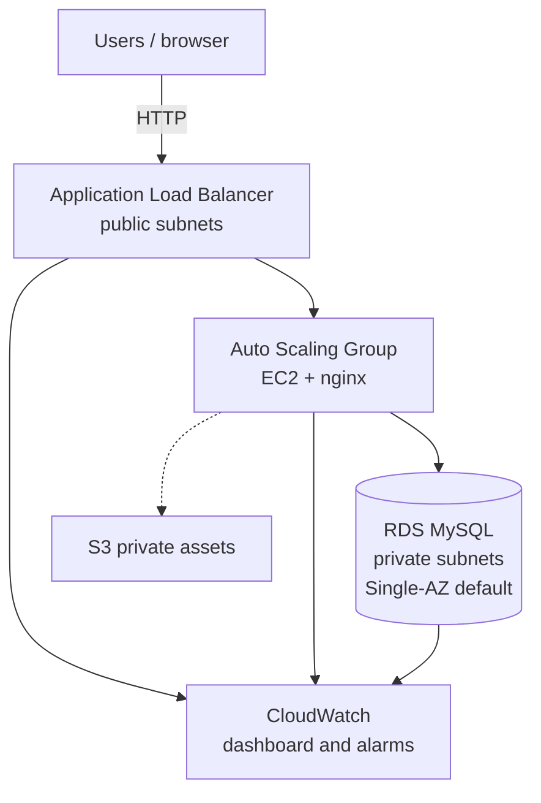

# Project 2 — AWS Cloud Infrastructure

[← Back to portfolio index](../README.md)

## Overview

Built and documented a multi-tier AWS environment with Terraform, covering networking, compute, database, storage, monitoring, and remote state. The stack was designed as reusable modules, deployed in phases, verified in the AWS Console, and torn down when idle to control lab cost.

## Repository layout

```
project-2-aws-infrastructure/
├── docs/
│   ├── ARCHITECTURE.md              # Diagram & phase plan
│   ├── REMOTE-STATE.md              # Phase 5 — S3 backend + DynamoDB locks
│   ├── Milestone-Screenshots/       # VPC, ALB, ASG, console evidence
│   └── Project 2 - What was Implemented.docx
└── terraform/
    ├── bootstrap/                   # Phase 5 — S3 + DynamoDB for remote state
    ├── main.tf                      # Composes modules
    ├── variables.tf
    ├── outputs.tf
    ├── providers.tf
    ├── versions.tf
    ├── backend.hcl.example          # Copy to backend.hcl after bootstrap
    ├── terraform.tfvars.example
    └── modules/
        ├── vpc/                     # Phase 1 — multi-AZ VPC
        ├── alb/                     # Phase 2 — Application Load Balancer
        ├── asg/                     # Phase 2 — Auto Scaling Group (nginx)
        ├── rds/                     # Phase 3 — RDS MySQL (Single-AZ default)
        ├── s3/                      # Phase 4 — private static assets bucket
        └── cloudwatch/              # Phase 4 — dashboard + alarms
```

## Architecture



Full diagram notes, security-group plan, and phase details: [docs/ARCHITECTURE.md](docs/ARCHITECTURE.md).  
Remote state steps: [docs/REMOTE-STATE.md](docs/REMOTE-STATE.md).

- **Phase 1 (done):** Multi-AZ VPC with public/private subnets, Internet Gateway, and route tables (Terraform).
- **Phase 2 (done):** Public Application Load Balancer, target group, security groups, and Auto Scaling Group (Amazon Linux + nginx).
- **Phase 3 (done):** Private RDS MySQL (`db.t3.micro`), Single-AZ by default; optional Multi-AZ toggle.
- **Phase 4 (done):** Private S3 static-assets bucket; CloudWatch dashboard and alarms (ALB/ASG; RDS when enabled).
- **Phase 5 (done):** Remote state bootstrap (S3 + DynamoDB lock); enable via `docs/REMOTE-STATE.md`.
- **Cost discipline:** NAT off by default; tear down **lab** stacks with `terraform destroy` when idle. Keep the **bootstrap** backend. Deploy steps live in [`terraform/README.md`](terraform/README.md).
