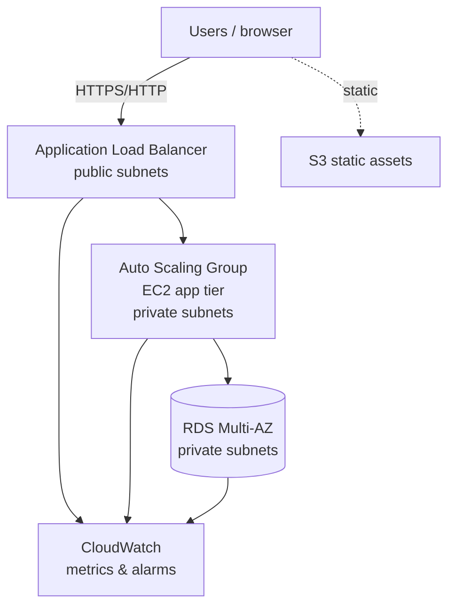

# Project 2 — Target architecture

Planned AWS layout for the portfolio stack (Terraform-managed).

## High-level flow

## Network (Phase 1 — implemented in Terraform)

| Tier | Subnets | Purpose |
|------|---------|---------|
| Public | 2 AZs | ALB, NAT gateway |
| Private | 2 AZs | EC2 (ASG), RDS |

- **VPC CIDR:** default `10.0.0.0/16` (override in `terraform.tfvars`)
- **NAT:** single NAT gateway in first public subnet (lab cost control)

## Security groups (Phase 2)

| SG | Inbound | Outbound |
|----|---------|----------|
| ALB | 80/443 from `0.0.0.0/0` | app port to app SG |
| App (EC2) | app port from ALB SG | 443 to internet (via NAT), DB port to RDS SG |
| RDS | DB port from app SG | none required for basic lab |

## Implementation phases

| Phase | Module | Status |
|-------|--------|--------|
| 1 | `modules/vpc` | **Implemented** |
| 2 | `modules/alb`, `modules/asg` | **Implemented** |
| 3 | `modules/rds` | **Implemented (Single-AZ default)** |
| 4 | `modules/s3`, `modules/cloudwatch` | Stub |
| 5 | Remote state (S3 + DynamoDB lock) | Commented in `versions.tf` |

### Phase 3 RDS

- Private subnets, not publicly accessible  
- DB port allowed **only** from the app security group (`enable_compute` required)  
- Default: **`rds_multi_az = false`** (`db.t3.micro`). Set `true` briefly to demo Multi-AZ, then destroy.

### Phase 2 lab networking

With `enable_nat_gateway = false` (default for cost control), the ASG is placed in **public** subnets with public IPs so user-data can install packages. Set `enable_nat_gateway = true` to place the ASG in **private** subnets (production-like).

## Relationship to Project 1

[Project 1](../project-1-ansible-lab/README.md) proves **Ansible + Linux automation** on VirtualBox.  
Project 2 moves the same discipline to **AWS + Terraform + observability**.
