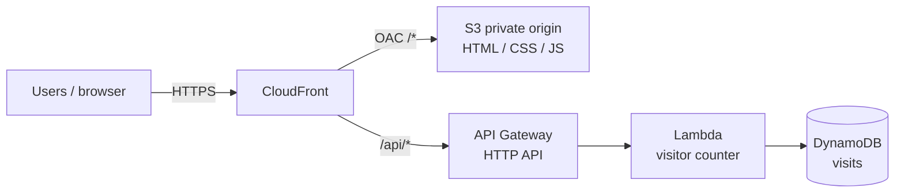

# Project 3 — Static Site + CloudFront + Visitor Counter

[← Back to portfolio index](../README.md)

## Overview

Built and documented a serverless static site with Terraform, covering private S3 hosting, CloudFront delivery, and a DynamoDB visitor counter via Lambda and API Gateway. The stack was modular, verified live over HTTPS, and kept available as a low-cost portfolio demo with budget alerts.

## Repository layout

```
project-3-static-site/
├── docs/
│   ├── ARCHITECTURE.md              # Diagram & phase plan
│   ├── Project 3 - What was Implemented.docx
│   └── Project 3 - Milestone Screenshots.docx
├── site/                            # Static HTML/CSS/JS uploaded to S3
└── terraform/
    ├── main.tf                      # Composes modules
    ├── variables.tf
    ├── outputs.tf
    ├── providers.tf
    ├── versions.tf
    ├── backend.hcl.example          # Reuses Project 2 state bucket (new key)
    ├── terraform.tfvars.example
    ├── lambda/visitor_counter/      # Python Lambda source
    └── modules/
        ├── s3_site/                 # Private origin bucket + objects
        ├── cloudfront/              # CDN + OAC (+ /api/* to API Gateway)
        ├── dynamodb/                # Visitor counter table
        └── api/                     # HTTP API + Lambda
```

## Architecture



Full component notes: [docs/ARCHITECTURE.md](docs/ARCHITECTURE.md).  
Deploy steps: [`terraform/README.md`](terraform/README.md).

- **Phase 1 (done):** Private S3 origin + CloudFront (OAC) serving the static site.
- **Phase 2 (done):** DynamoDB visitor counter + Lambda + API Gateway; CloudFront `/api/*` route.
- **Phase 3 (done):** Landing page UI (branding, counter, GitHub/LinkedIn links), screenshots, budget alerts.
- **Cost discipline:** very cheap when idle; optional `terraform destroy` when the live URL is not needed. Keep Project 2 **bootstrap** remote-state resources if used elsewhere.
