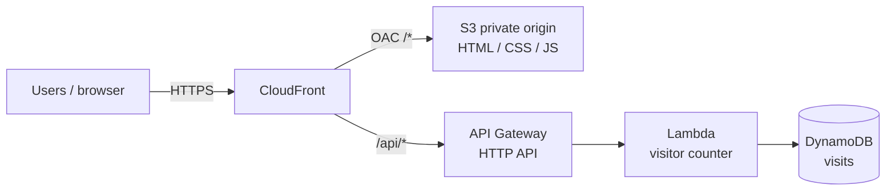

# Project 3 — Architecture

Serverless static site with a DynamoDB-backed visitor counter (Terraform-managed).

## High-level flow

## Components

| Piece | Purpose |
|-------|---------|
| S3 | Private bucket holding static site files (not public website hosting) |
| CloudFront OAC | HTTPS edge; only CloudFront can read the bucket |
| DynamoDB | Single-item counter (`id = site`, `visits` number) |
| Lambda | Atomically increments and returns the visit count |
| API Gateway | HTTP API route `GET /api/visitors` |

## Implementation phases

| Phase | Scope | Status |
|-------|--------|--------|
| 1 | `modules/s3_site`, `modules/cloudfront` (static site) | **Implemented** |
| 2 | `modules/dynamodb`, `modules/api` + CloudFront `/api/*` | **Implemented** |
| 3 | Landing page UI, screenshots, budget monitoring | **Implemented** |

## Security notes

- S3 bucket is **private**; public access blocked; bucket policy allows CloudFront OAC only.
- API is intentionally simple for a lab (no auth). Suitable for a portfolio demo, not production abuse-sensitive workloads.
- No custom domain / ACM in v1 — use the CloudFront default domain.

## Relationship to Projects 1–2 and 4

- [Project 1](../project-1-ansible-lab/README.md): Ansible + RHEL automation on VirtualBox.
- [Project 2](../project-2-aws-infrastructure/README.md): multi-tier VPC / ALB / ASG / RDS lab + remote state bootstrap.
- [Project 4](../project-4-cicd/README.md): CodePipeline + CodeBuild deploys this site on push to `main`.
- **Project 3:** serverless edge + data plane (S3, CloudFront, DynamoDB, Lambda).
