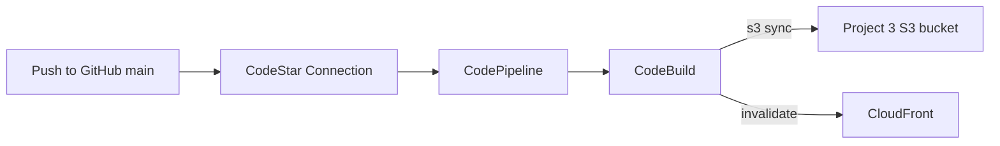

# Project 4 — CI/CD for Static Site (CodePipeline + CodeBuild)

[← Back to portfolio index](../README.md)

## Overview

Built an AWS CI/CD pipeline with CodePipeline and CodeBuild that deploys the Project 3 static site to S3 and invalidates CloudFront on every push to main. GitHub is connected via CodeStar Connections; pipeline success was verified with live site updates.

## Repository layout

```
project-4-cicd/
├── docs/
│   ├── ARCHITECTURE.md
│   ├── Project 4 - What was Implemented.docx
│   └── Project 4 - Milestone Screenshots.docx
├── buildspec.yml                    # Deploy steps run by CodeBuild
└── terraform/
    ├── main.tf                      # Pipeline + Build + IAM + artifacts
    ├── variables.tf
    ├── outputs.tf
    ├── providers.tf
    ├── versions.tf
    ├── backend.hcl.example
    └── terraform.tfvars.example
```

## Architecture



Full component notes: [docs/ARCHITECTURE.md](docs/ARCHITECTURE.md).  
Apply / GitHub connection steps: [`terraform/README.md`](terraform/README.md).

- **Source:** CodePipeline pulls `mrbobbyboykin/Projects` (`main`) via CodeStar Connection (GitHub App).
- **Deploy:** CodeBuild runs `buildspec.yml` — syncs `project-3-static-site/site/` to S3, then invalidates CloudFront.
- **Supporting:** private artifacts bucket + least-privilege IAM for Pipeline and CodeBuild.
- **Cost note:** roughly **~$1–5/month** for light use (pipeline + short builds), on top of Project 3 hosting. Safe to leave idle with a budget alert.
