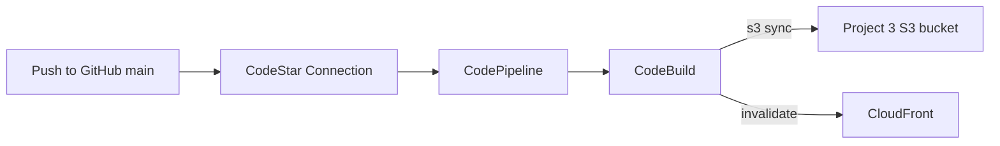

# Project 4 — Architecture

CI/CD for the Project 3 static site using **AWS CodePipeline** + **AWS CodeBuild**.

## High-level flow

## Components

| Piece | Purpose |
|-------|---------|
| CodeStar Connection | Authorized link from AWS to GitHub repo |
| CodePipeline | Orchestrates Source → Deploy on each `main` push |
| CodeBuild | Runs `buildspec.yml` (S3 sync + CloudFront invalidation) |
| Artifacts S3 bucket | Temporary pipeline artifacts (private) |

## Security notes

- CodeBuild role is scoped to the Project 3 site bucket + CloudFront invalidation + logs
- Artifact bucket is private with public access blocked
- No long-lived GitHub PATs in Terraform — use CodeStar Connection (complete OAuth once in console)

## Relationship to Project 3

Project 3 owns the live site resources. Project 4 only **deploys into** them. Destroying Project 4 stops automation; destroying Project 3 removes the site the pipeline deploys to.
