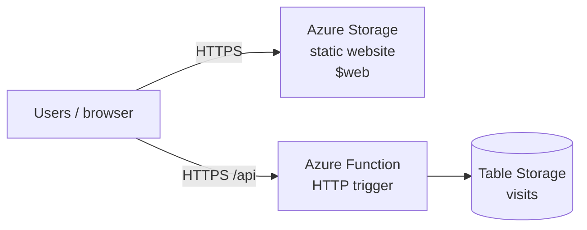

# Project 5 — Azure Static Site + Visitor Counter

[← Back to portfolio index](../README.md)

## Overview

Built and documented a serverless static site on Microsoft Azure with Terraform, covering Storage static website hosting, an Azure Function visitor counter, and Azure Table Storage. The stack was modular, verified live over HTTPS with a distinct Azure UI, and kept available as a low-cost multi-cloud portfolio demo with budget alerts.

## Repository layout

```
project-5-azure-static-site/
├── docs/
│   ├── ARCHITECTURE.md              # Diagram & phase plan
│   ├── Project 5 - What was Implemented.docx
│   └── Project 5 - Milestone Screenshots.docx
├── site/                            # Static HTML/CSS/JS → $web container
└── terraform/
    ├── main.tf                      # Composes modules
    ├── variables.tf
    ├── outputs.tf
    ├── providers.tf
    ├── versions.tf
    ├── terraform.tfvars.example
    ├── function/                    # Python Azure Function (visitor counter)
    └── modules/
        ├── storage_site/            # Storage Account static website + objects
        └── api/                     # Function App + Table Storage
```

## Architecture



## What was implemented

### Live Site Implemented

- https://portfoliolablabyy27y8.z13.web.core.windows.net/

### Terraform (AzureRM) infrastructure

- Built reusable Terraform modules: modules/storage_site and modules/api
- Resources are composed in terraform/main.tf and parameterized by region/environment variables.

### Azure Storage static website hosting

- Created an Azure Storage Account configured for static website hosting.
- Uploaded the static site files (index.html, styles.css, app.js, and config.js) into the $web container via Terraform.

### Static Website/UI

### Visitor counter API

- Implemented an Azure Function (Consumption / Y1) with an HTTP endpoint.
- The function increments and returns the visit counter over HTTPS.

### Table Storage counter backend

- Created an Azure Table Storage table (named visits) to store the counter data.

### CORS configuration

- Configured the Function CORS policy to allow calls from the Storage static website origin.

### Function deployment

- Packaged the Function source into a zip (data "archive_file") and deployed it using Terraform local-exec with az functionapp deployment source config-zip.

### Config-driven API URL

- Terraform generates config.js so the frontend knows whether to call the real Function endpoint or a disabled/default path.

### Azure subscription quota workaround

- Added an enable_visitor_api flag so the static site can still deploy when the subscription has 0 VM compute quota.

### Cost discipline

- Able to destroy infrastructure when not demoing.
