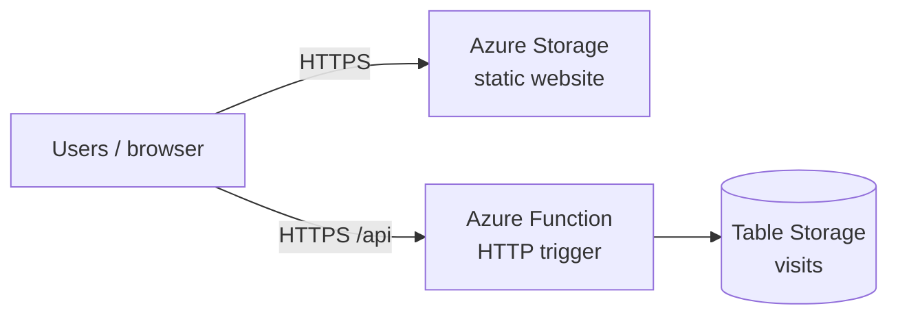

# Project 5 — Azure Static Site + Visitor Counter

[← Back to portfolio index](../README.md)

## Overview

Built and documented a serverless static site on **Microsoft Azure** with Terraform, covering Storage static website hosting, an Azure Function visitor counter, and Azure Table Storage. The stack mirrors Project 3’s AWS pattern on a second cloud for multi-cloud portfolio evidence.

## What was implemented

- **Terraform (AzureRM)** — resource group, Storage, Function App, and Table Storage defined as reusable modules (`storage_site`, `api`).
- **Static website** — Storage Account with the `$web` container; HTML/CSS/JS uploaded by Terraform.
- **Distinct Azure UI** — light card layout and Azure-specific copy (not a clone of the AWS CloudFront site).
- **Visitor counter (optional)** — Python Azure Function (Consumption / Y1) increments a count in Table Storage and returns JSON over HTTPS.
- **CORS** — Function allows browser calls from the Storage static-website origin.
- **Function zip deploy** — `az functionapp deployment source config-zip` from Terraform `local-exec`.
- **Quota workaround** — `enable_visitor_api` flag so the static site can deploy when a new subscription has 0 VM quota; Function can be enabled after a quota increase.
- **Docs** — architecture notes, deploy/teardown steps, and milestone screenshots.

## Repository layout

```
project-5-azure-static-site/
├── docs/
│   ├── ARCHITECTURE.md
│   ├── Project 5 - What was Implemented.docx
│   └── Project 5 - Milestone Screenshots.docx
├── site/                            # Static HTML/CSS/JS → $web container
└── terraform/
    ├── main.tf
    ├── variables.tf
    ├── outputs.tf
    ├── providers.tf
    ├── versions.tf
    ├── terraform.tfvars.example
    ├── function/                    # Python Azure Function (visitor counter)
    └── modules/
        ├── storage_site/
        └── api/
```

## Architecture



Full notes: [docs/ARCHITECTURE.md](docs/ARCHITECTURE.md).  
Deploy steps: [`terraform/README.md`](terraform/README.md).

- **Phase 1:** Storage Account with static website + site files uploaded by Terraform.
- **Phase 2:** Consumption-plan Azure Function + Table Storage visitor counter (CORS-enabled).
- **Stretch (optional):** Azure Front Door / CDN in front of the storage origin (CloudFront parallel).

**Prerequisites:** Azure subscription, [Azure CLI](https://learn.microsoft.com/cli/azure/install-azure-cli) (`az login`), Terraform `>= 1.5`.

**Cost discipline:** very cheap when idle; `terraform destroy` when not demoing. Set an Azure budget alert like your AWS $5 budget.
