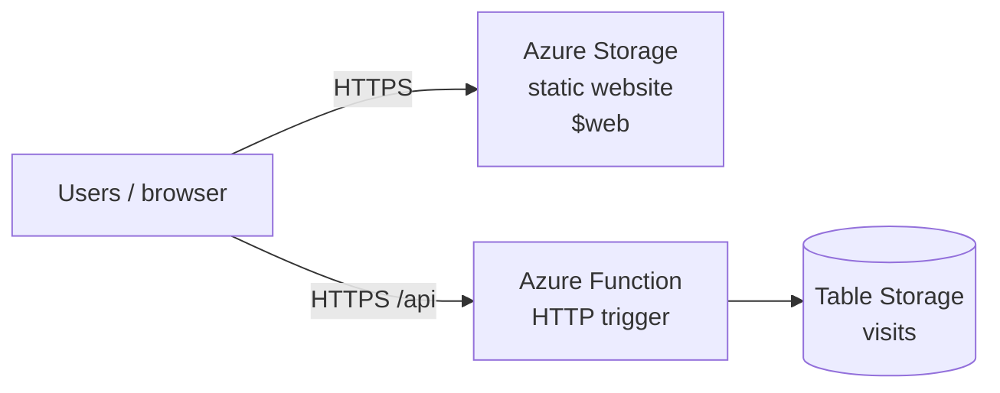

# Project 5 — Azure Static Site + Visitor Counter

[← Back to portfolio index](../README.md)

## Overview

Built and documented a serverless static site on Microsoft Azure with Terraform, covering Storage static website hosting, an Azure Function visitor counter, and Azure Table Storage. The stack was modular, verified live over HTTPS with a distinct Azure UI, and kept available as a low-cost multi-cloud portfolio demo with budget alerts.

## Repository layout

```
project-5-azure-static-site/
├── docs/
│   ├── ARCHITECTURE.md              # Diagram & phase plan
│   ├── Project 5 - What was Implemented.docx
│   └── Project 5 - Milestone Screenshots.docx
├── site/                            # Static HTML/CSS/JS → $web container
└── terraform/
    ├── main.tf                      # Composes modules
    ├── variables.tf
    ├── outputs.tf
    ├── providers.tf
    ├── versions.tf
    ├── terraform.tfvars.example
    ├── function/                    # Python Azure Function (visitor counter)
    └── modules/
        ├── storage_site/            # Storage Account static website + objects
        └── api/                     # Function App + Table Storage
```

## Architecture


