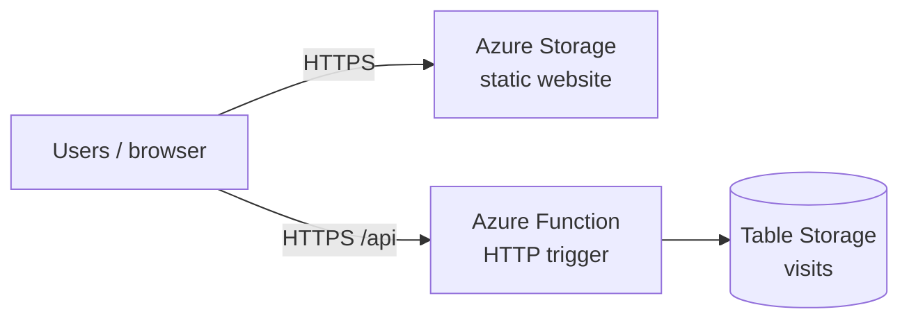

# Project 5 — Azure Static Site + Visitor Counter

[← Back to portfolio index](../README.md)

## Overview

Built and documented a serverless static site on **Microsoft Azure** with Terraform, covering Storage static website hosting, an Azure Function visitor counter, and Azure Table Storage. The stack mirrors Project 3’s AWS pattern on a second cloud for multi-cloud portfolio evidence.

## Repository layout

```
project-5-azure-static-site/
├── docs/
│   └── ARCHITECTURE.md
├── site/                            # Static HTML/CSS/JS → $web container
└── terraform/
    ├── main.tf
    ├── variables.tf
    ├── outputs.tf
    ├── providers.tf
    ├── versions.tf
    ├── terraform.tfvars.example
    ├── function/                    # Python Azure Function (visitor counter)
    └── modules/
        ├── storage_site/
        └── api/
```

## Architecture



Full notes: [docs/ARCHITECTURE.md](docs/ARCHITECTURE.md).  
Deploy steps: [`terraform/README.md`](terraform/README.md).

- **Phase 1:** Storage Account with static website + site files uploaded by Terraform.
- **Phase 2:** Consumption-plan Azure Function + Table Storage visitor counter (CORS-enabled).
- **Stretch (optional):** Azure Front Door / CDN in front of the storage origin (CloudFront parallel).

**Prerequisites:** Azure subscription, [Azure CLI](https://learn.microsoft.com/cli/azure/install-azure-cli) (`az login`), Terraform `>= 1.5`.

**Cost discipline:** very cheap when idle; `terraform destroy` when not demoing. Set an Azure budget alert like your AWS $5 budget.
