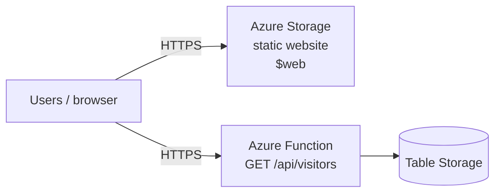

# Project 5 — Architecture

Serverless static site on Azure with a Table Storage–backed visitor counter (Terraform-managed). Azure mirror of [Project 3](../project-3-static-site/README.md).

## High-level flow

## Components

| Piece | Purpose | AWS parallel (Project 3) |
|-------|---------|---------------------------|
| Storage Account static website | Hosts HTML/CSS/JS over HTTPS | S3 + (partially) CloudFront |
| Azure Function (Consumption) | Increments and returns visit count | Lambda + API Gateway |
| Table Storage | Stores `visits` counter | DynamoDB |
| CORS on Function | Browser calls Function from the site origin | CloudFront `/api/*` same-origin |

## Implementation phases

| Phase | Scope | Status |
|-------|--------|--------|
| 1 | `modules/storage_site` | **Implemented** |
| 2 | `modules/api` (Function + table) | **Implemented** |
| 3 | Front Door / CDN (optional stretch) | Planned |

## Security notes

- Static site is public by design (portfolio demo).
- Function allows CORS from the storage website origin (and `*` in lab if needed for first load).
- No auth on the counter API (same lab posture as Project 3).

## Relationship to other projects

- **Project 3:** same product idea on AWS.
- **Project 4:** AWS CI/CD for Project 3 (Azure DevOps / GitHub Actions → Azure can be a later stretch).
