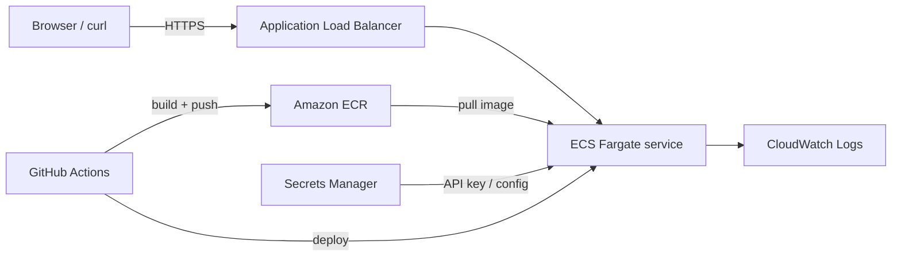

# Project 6 — Secure Containerized API on AWS (Docker + ECR + ECS)

[← Back to portfolio index](../README.md)

## Overview

Build and run a small production-shaped API as a **Docker image** on AWS: push to **ECR**, run on **ECS Fargate** behind an **ALB**, store secrets in **Secrets Manager**, and ship logs to **CloudWatch**. Optional stretch: GitHub Actions CI (build → scan → deploy) and basic WAF / GuardDuty.

This is the hands-on lab that bridges your static-site / Terraform work toward **AWS Cloud Engineer** and **Cloud Security** roles.

## Status

**In progress** — Phase 0 (local Docker) complete. Phases 1+ checklist in [docs/ARCHITECTURE.md](docs/ARCHITECTURE.md).

## Target architecture



Full phases, cost plan, and checklist: [docs/ARCHITECTURE.md](docs/ARCHITECTURE.md).

## What you will learn

- Docker image build (non-root user, health endpoint)
- ECR push + image scanning
- ECS Fargate task definition, service, and ALB health checks
- IAM least privilege (task execution role vs task role)
- Secrets Manager (no secrets in the image or Terraform state if possible)
- CloudWatch logging and a simple alarm
- Optional: CI/CD with Trivy scan, WAF, GuardDuty

## Cost target

- **Active lab weekend:** roughly **$5–15** if you use the cheap path (no NAT Gateway)
- **Left running 1 month (cheap path):** roughly **$15–40**
- **With NAT Gateway (more production-like):** add ~**$32/month** — only enable for a short stretch, then destroy

Always run `terraform destroy` (or stop the ECS service) when you are done for the week. Add a **AWS Budgets** alert at $20–25.

## Repository layout (planned)

```
project-6-secure-containers/
├── docs/
│   └── ARCHITECTURE.md          ← phases, checklist, cost plan
├── app/                         ← Flask API + Dockerfile (Phase 0)
│   ├── main.py
│   ├── requirements.txt
│   ├── Dockerfile
│   ├── .dockerignore
│   └── README.md
├── .github/workflows/           ← optional CI (stretch)
└── terraform/                   ← VPC/ALB/ECS/ECR/IAM/Secrets
```

## Resume bullet (draft — update after you finish)

> Built and deployed a containerized API on AWS using Docker, ECR, and ECS Fargate behind an ALB—securing runtime config with Secrets Manager and CloudWatch logging, and automating image build/deploy via CI—demonstrating production-style container operations and cloud security controls.

## Next step

Open [docs/ARCHITECTURE.md](docs/ARCHITECTURE.md) and start **Phase 0** (local Docker) this weekend.
