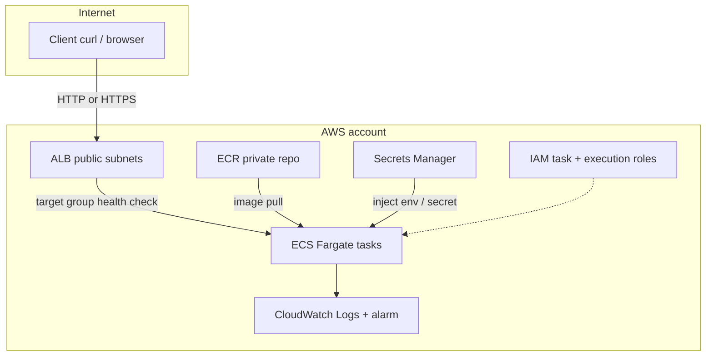

# Project 6 — Architecture & Weekend Lab Checklist

Secure containerized API on AWS: **Docker → ECR → ECS Fargate → ALB**, with secrets and logging.

## Goal

Ship a tiny HTTP API that:

1. Runs in a Docker container (health check + non-root user)
2. Is stored in **Amazon ECR**
3. Runs on **ECS Fargate** behind an **Application Load Balancer**
4. Reads a secret from **Secrets Manager** (not baked into the image)
5. Writes logs to **CloudWatch Logs**
6. Can be torn down cleanly with Terraform when idle

Stretch (after the core works): GitHub Actions build/scan/deploy, ECR vulnerability scan gate, optional WAF + GuardDuty.

## High-level architecture




### Cheap path vs production-like path


| Choice              | Networking                                          | Monthly feel | When to use                      |
| ------------------- | --------------------------------------------------- | ------------ | -------------------------------- |
| **Cheap (default)** | Tasks in **public** subnets with public IPs; no NAT | Lower        | Weekend lab, portfolio demo      |
| **Production-like** | Tasks in **private** subnets + **NAT Gateway**      | +~$32 NAT    | Short stretch only, then destroy |


Start cheap. Turn on private + NAT only after the app works end-to-end.

## AWS services involved


| Service         | Role                                                        |
| --------------- | ----------------------------------------------------------- |
| ECR             | Store Docker images; optional scan on push                  |
| ECS Fargate     | Run containers without managing EC2                         |
| ALB             | Public entry, health checks, path routing                   |
| VPC             | Subnets, security groups                                    |
| IAM             | Execution role (pull image, logs) + task role (read secret) |
| Secrets Manager | Runtime secret (API key or demo token)                      |
| CloudWatch      | Container logs + simple 5xx / unhealthy-host alarm          |
| Terraform       | Infrastructure as code (same pattern as Projects 2–4)       |
| GitHub Actions  | Stretch: build, Trivy scan, push, deploy                    |


## App shape (keep it tiny)

One process, two routes:

- `GET /health` → `200 {"status":"ok"}` (ALB health check)
- `GET /` or `GET /info` → returns hostname + that a secret **exists** (never print the secret value)

Language: Python (Flask/FastAPI) or Node — pick what you type fastest. Non-root user in the Dockerfile.

---

## Cost plan (keep under control)

### Budget rules

1. Create an **AWS Budget** alert at **$20** (and optionally $40).
2. Prefer **us-east-1** (same region as your other labs).
3. Use **1 task**, smallest Fargate size (`0.25 vCPU / 0.5 GB`).
4. Default: **no NAT Gateway**.
5. When done for the week: `terraform destroy` **or** set desired count to `0` and delete the ALB if you want mid-week savings.

### Rough cost bands


| Scenario                                                 | Estimate                                                    |
| -------------------------------------------------------- | ----------------------------------------------------------- |
| Weekend only (build, run 8–16 hours, destroy)            | **~$5–15**                                                  |
| Cheap path left up ~1 month (ALB + 1 Fargate task + ECR) | **~$15–40**                                                 |
| Same + NAT Gateway left up                               | **+$32/month** — avoid unless practicing private networking |
| Idle after destroy                                       | Near **$0** (ECR storage pennies if you keep images)        |


Biggest cost drivers: **ALB** (hours), **Fargate** (hours), **NAT** (if enabled). ECR and Secrets Manager are usually small.

---

## Weekend checklist

Work in order. Check boxes as you go. Screenshot milestones for a future “What was Implemented” doc.

### Phase 0 — Local (2–3 hours, $0)

- [x] Create folder layout under `project-6-secure-containers/app/`
- [x] Write a minimal API with `/health` and `/info`
- [x] Write a `Dockerfile` (non-root user, pin base image tag)
- [x] `docker build` and `docker run -p 8080:8080`
- [x] Confirm `curl localhost:8080/health` works
- [x] Add a `.dockerignore` and a short `app/README.md`

### Phase 1 — Image registry (1–2 hours, cents)

- [x] Create ECR repo with Terraform (or CLI once, then codify)
- [x] Authenticate Docker to ECR
- [x] Tag + push image
- [x] Confirm image visible in ECR console
- [x] (Optional) Enable **scan on push** and open findings

ECR repo: `project6-api` → `345485442145.dkr.ecr.us-east-1.amazonaws.com/project6-api:latest`

### Phase 2 — Run on ECS + ALB (half day, real $)

- [x] Terraform: VPC (2 public subnets minimum for ALB), security groups
- [x] Terraform: ECR (if not already), ECS cluster, task definition, service
- [x] Terraform: ALB + target group + listener (HTTP first; HTTPS later if you want)
- [x] Wire `/health` as the target group health check
- [x] Deploy 1 Fargate task; confirm ALB DNS returns `/health` and `/info`
- [x] Confirm logs appear in CloudWatch Logs
- [x] Screenshot: healthy target + sample response

Live URLs (cheap path, HTTP) — updated after Phase 4 destroy/redeploy:

- Health: `http://project6-lab-alb-938853083.us-east-1.elb.amazonaws.com/health`
- Info: `http://project6-lab-alb-938853083.us-east-1.elb.amazonaws.com/info`
- Logs: CloudWatch `/ecs/project6-lab-api`

**Cost note:** ALB + 1 Fargate task are billing while this is up. Destroy or scale to 0 when idle.

### Phase 3 — Secrets + IAM hardening (2–3 hours)

- [x] Store a demo secret in Secrets Manager
- [x] Task **execution** role: pull from ECR, write logs (+ GetSecretValue for injection)
- [x] Task **role**: read only that secret
- [x] Inject secret into the task (env from Secrets Manager)
- [x] Prove `/info` sees the secret is present without logging its value
- [x] Screenshot: IAM roles + secret reference in task definition

Secret: `project6/lab/app-secret`  
Task definition revision **2**: `APP_SECRET` comes from Secrets Manager ARN (not plaintext env).  
`/info` still returns `"secret_configured": true` without exposing the value.

### Phase 4 — Observability + cost guardrails (1–2 hours)

- [x] CloudWatch alarm on unhealthy hosts or ALB 5xx
- [x] AWS Budget alert ($20)
- [x] Document destroy steps in `terraform/README.md`
- [x] Practice `terraform destroy` and redeploy once

Codified in `terraform/observability.tf` (imported console resources + new budget):

- SNS: `project6-lab-alerts` → email alerts
- Alarms: `project6-lab-unhealthy-hosts`, `project6-lab-4xx-count`
- Budget: `project6-lab-20` ($20 monthly; 80%/100% actual + 100% forecasted)

Destroy/redeploy practiced: **30 destroyed → 30 added**, image re-pushed to ECR, `/health` OK on new ALB DNS.  
After recreate: re-confirm the SNS email subscription.  
If you still have console budget **My Monthly Cost Budget**, delete it to avoid a duplicate $20 budget.

**Current ALB (after redeploy):**

- Health: `http://project6-lab-alb-938853083.us-east-1.elb.amazonaws.com/health`
- Info: `http://project6-lab-alb-938853083.us-east-1.elb.amazonaws.com/info`

### Phase 5 — Stretch CI/CD + security controls

- [x] GitHub Actions: build → Trivy scan → push to ECR
- [x] Deploy new task definition / force new ECS deployment
- [x] Fail the pipeline on HIGH/CRITICAL image CVEs (`exit-code: "1"`)
- [x] AWS WAF on ALB (Common + Known Bad Inputs managed rule groups)
- [x] GuardDuty detector enabled in `us-east-1`
- [x] GitHub OIDC provider + IAM role codified in Terraform (`github-oidc.tf`)

**Terraform files:** `github-oidc.tf`, `waf.tf`, `guardduty.tf`  
**Workflow:** `.github/workflows/project6-deploy.yml`  
**Role ARN (GitHub var `AWS_ROLE_ARN_PROJECT6`):** `arn:aws:iam::345485442145:role/project6-github-actions-ecr-ecs`

**GuardDuty watches (high level):** unusual API activity, compromised instances/credentials signals, recon, and other account/region threat findings (not app-specific like WAF).  
**WAF:** regional Web ACL associated with the ALB; default allow + managed rules that can block matching requests.

**Note:** With Trivy fail-closed, the next Actions run will stop before push/deploy if HIGH/CRITICAL findings exist (even with `ignore-unfixed: true` for unfixed-only noise).

---

## Suggested Terraform modules (when you implement)

Mirror Project 2 style so the portfolio stays consistent:

```
terraform/
├── main.tf
├── variables.tf
├── outputs.tf
├── providers.tf
├── versions.tf
├── terraform.tfvars.example
└── modules/
    ├── network/     # VPC, subnets, SG
    ├── ecr/
    ├── ecs/         # cluster, task, service
    ├── alb/
    └── secrets/     # secret + IAM pieces or keep IAM in ecs
```

Outputs to print: ALB DNS name, ECR repo URL, ECS cluster/service names, CloudWatch log group.

---

## Success criteria (portfolio-ready)

You are “done” for a resume/LinkedIn bullet when:

1. Public ALB URL serves `/health` = 200
2. Image lives in ECR and ECS pulls it
3. Secret comes from Secrets Manager
4. Logs are in CloudWatch
5. Stack is in Terraform and can be destroyed/recreated
6. You have 4–6 screenshots + a short “What was Implemented” write-up

---

## Resume / LinkedIn notes

**Title ideas:** Secure Container Platform Lab · ECS Fargate API · Docker on AWS  

**Skills to attach later:** Docker, Amazon ECS, Amazon ECR, AWS Fargate, Application Load Balancer, AWS Secrets Manager, IAM, CloudWatch, Terraform, (stretch) GitHub Actions, WAF  

**Draft bullet (after completion):**

> Designed and deployed a containerized API on AWS with Docker, ECR, and ECS Fargate behind an ALB—using Secrets Manager, least-privilege IAM, and CloudWatch logging—and automated image build and deploy with CI, demonstrating production-style container operations.

---

## Safety

- Never commit AWS keys, `terraform.tfvars` with secrets, or real API tokens
- Prefer IAM roles / short-lived credentials over long-lived access keys
- If a key was ever pasted into notes or chat, **rotate it in IAM immediately**

