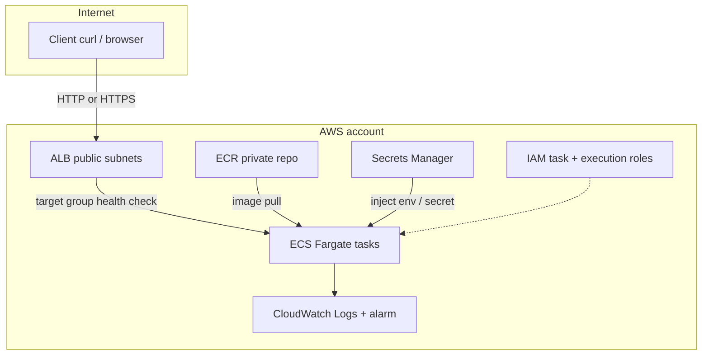

# Project 6 — Architecture & Weekend Lab Checklist

Secure containerized API on AWS: **Docker → ECR → ECS Fargate → ALB**, with secrets and logging.

## Goal

Ship a tiny HTTP API that:

1. Runs in a Docker container (health check + non-root user)
2. Is stored in **Amazon ECR**
3. Runs on **ECS Fargate** behind an **Application Load Balancer**
4. Reads a secret from **Secrets Manager** (not baked into the image)
5. Writes logs to **CloudWatch Logs**
6. Can be torn down cleanly with Terraform when idle

Stretch (after the core works): GitHub Actions build/scan/deploy, ECR vulnerability scan gate, optional WAF + GuardDuty.

## High-level architecture



### Cheap path vs production-like path

| Choice | Networking | Monthly feel | When to use |
|--------|------------|--------------|-------------|
| **Cheap (default)** | Tasks in **public** subnets with public IPs; no NAT | Lower | Weekend lab, portfolio demo |
| **Production-like** | Tasks in **private** subnets + **NAT Gateway** | +~$32 NAT | Short stretch only, then destroy |

Start cheap. Turn on private + NAT only after the app works end-to-end.

## AWS services involved

| Service | Role |
|---------|------|
| ECR | Store Docker images; optional scan on push |
| ECS Fargate | Run containers without managing EC2 |
| ALB | Public entry, health checks, path routing |
| VPC | Subnets, security groups |
| IAM | Execution role (pull image, logs) + task role (read secret) |
| Secrets Manager | Runtime secret (API key or demo token) |
| CloudWatch | Container logs + simple 5xx / unhealthy-host alarm |
| Terraform | Infrastructure as code (same pattern as Projects 2–4) |
| GitHub Actions | Stretch: build, Trivy scan, push, deploy |

## App shape (keep it tiny)

One process, two routes:

- `GET /health` → `200 {"status":"ok"}` (ALB health check)
- `GET /` or `GET /info` → returns hostname + that a secret **exists** (never print the secret value)

Language: Python (Flask/FastAPI) or Node — pick what you type fastest. Non-root user in the Dockerfile.

---

## Cost plan (keep under control)

### Budget rules

1. Create an **AWS Budget** alert at **$20** (and optionally $40).
2. Prefer **us-east-1** (same region as your other labs).
3. Use **1 task**, smallest Fargate size (`0.25 vCPU / 0.5 GB`).
4. Default: **no NAT Gateway**.
5. When done for the week: `terraform destroy` **or** set desired count to `0` and delete the ALB if you want mid-week savings.

### Rough cost bands

| Scenario | Estimate |
|----------|----------|
| Weekend only (build, run 8–16 hours, destroy) | **~$5–15** |
| Cheap path left up ~1 month (ALB + 1 Fargate task + ECR) | **~$15–40** |
| Same + NAT Gateway left up | **+$32/month** — avoid unless practicing private networking |
| Idle after destroy | Near **$0** (ECR storage pennies if you keep images) |

Biggest cost drivers: **ALB** (hours), **Fargate** (hours), **NAT** (if enabled). ECR and Secrets Manager are usually small.

---

## Weekend checklist

Work in order. Check boxes as you go. Screenshot milestones for a future “What was Implemented” doc.

### Phase 0 — Local (2–3 hours, $0)

- [x] Create folder layout under `project-6-secure-containers/app/`
- [x] Write a minimal API with `/health` and `/info`
- [x] Write a `Dockerfile` (non-root user, pin base image tag)
- [x] `docker build` and `docker run -p 8080:8080`
- [x] Confirm `curl localhost:8080/health` works
- [x] Add a `.dockerignore` and a short `app/README.md`

### Phase 1 — Image registry (1–2 hours, cents)

- [ ] Create ECR repo with Terraform (or CLI once, then codify)
- [ ] Authenticate Docker to ECR
- [ ] Tag + push image
- [ ] Confirm image visible in ECR console
- [ ] (Optional) Enable **scan on push** and open findings

### Phase 2 — Run on ECS + ALB (half day, real $)

- [ ] Terraform: VPC (2 public subnets minimum for ALB), security groups
- [ ] Terraform: ECR (if not already), ECS cluster, task definition, service
- [ ] Terraform: ALB + target group + listener (HTTP first; HTTPS later if you want)
- [ ] Wire `/health` as the target group health check
- [ ] Deploy 1 Fargate task; confirm ALB DNS returns `/health` and `/info`
- [ ] Confirm logs appear in CloudWatch Logs
- [ ] Screenshot: healthy target + sample response

### Phase 3 — Secrets + IAM hardening (2–3 hours)

- [ ] Store a demo secret in Secrets Manager
- [ ] Task **execution** role: pull from ECR, write logs
- [ ] Task **role**: read only that secret
- [ ] Inject secret into the task (env from Secrets Manager)
- [ ] Prove `/info` sees the secret is present without logging its value
- [ ] Screenshot: IAM roles + secret reference in task definition

### Phase 4 — Observability + cost guardrails (1–2 hours)

- [ ] CloudWatch alarm on unhealthy hosts or ALB 5xx
- [ ] AWS Budget alert ($20)
- [ ] Document destroy steps in `terraform/README.md`
- [ ] Practice `terraform destroy` and redeploy once

### Phase 5 — Stretch CI/CD (optional, next weekend)

- [ ] GitHub Actions: build → Trivy scan → push to ECR
- [ ] Deploy new task definition / force new ECS deployment
- [ ] Fail the pipeline on HIGH/CRITICAL image CVEs (or warn-only first)
- [ ] (Optional) AWS WAF on ALB with a basic managed rule set
- [ ] (Optional) GuardDuty enabled; note what it watches

---

## Suggested Terraform modules (when you implement)

Mirror Project 2 style so the portfolio stays consistent:

```
terraform/
├── main.tf
├── variables.tf
├── outputs.tf
├── providers.tf
├── versions.tf
├── terraform.tfvars.example
└── modules/
    ├── network/     # VPC, subnets, SG
    ├── ecr/
    ├── ecs/         # cluster, task, service
    ├── alb/
    └── secrets/     # secret + IAM pieces or keep IAM in ecs
```

Outputs to print: ALB DNS name, ECR repo URL, ECS cluster/service names, CloudWatch log group.

---

## Success criteria (portfolio-ready)

You are “done” for a resume/LinkedIn bullet when:

1. Public ALB URL serves `/health` = 200  
2. Image lives in ECR and ECS pulls it  
3. Secret comes from Secrets Manager  
4. Logs are in CloudWatch  
5. Stack is in Terraform and can be destroyed/recreated  
6. You have 4–6 screenshots + a short “What was Implemented” write-up  

---

## Resume / LinkedIn notes

**Title ideas:** Secure Container Platform Lab · ECS Fargate API · Docker on AWS  

**Skills to attach later:** Docker, Amazon ECS, Amazon ECR, AWS Fargate, Application Load Balancer, AWS Secrets Manager, IAM, CloudWatch, Terraform, (stretch) GitHub Actions, WAF  

**Draft bullet (after completion):**

> Designed and deployed a containerized API on AWS with Docker, ECR, and ECS Fargate behind an ALB—using Secrets Manager, least-privilege IAM, and CloudWatch logging—and automated image build and deploy with CI, demonstrating production-style container operations.

---

## Safety

- Never commit AWS keys, `terraform.tfvars` with secrets, or real API tokens
- Prefer IAM roles / short-lived credentials over long-lived access keys
- If a key was ever pasted into notes or chat, **rotate it in IAM immediately**
